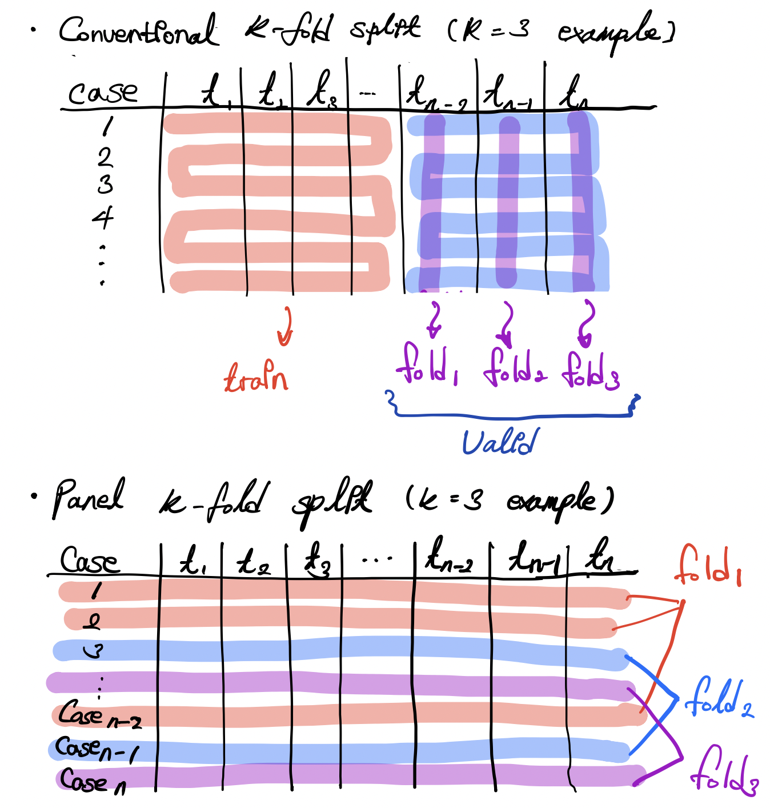

# Dacon : Growth Prediction

## 🏆 Goal
- Predict Growth of Bok Choi

## 📋 LeaderBoard
- 27th out of 171 teams

## Data
- Time Series
    - Environment : Temperature, Humidity, Light...
- Target
    - Growth Rate 

## 🔖 Retrospection

### Difficulty

Google Colab changed their policy on charging! It became much more expensive than before!

Because of fee, I had only two chances to train new model and hyperparameter tuning is not allowed (it takes such a long time.)

My worry became reality. I hoped this would not happen... 😥...

### Data Prep.

The dataset is basically time-series, encoded with integer. some variables, such as `Fan State` looks like categorical or ordinal. Based on my research, the data is collected by `Arduino` or `Rasberry Pi`, both are popular system for monitoring plants. Anyway, since each of `equipment status` (including heating system) range from 0 to 255. Regardless of meaning, I considered it as ordinal.

Preprocessing precedure was not special, but there are my new experiments.

- Approach
    1. Let's think this is Panel data
    2. Target Variable Augmentation
    3. K-fold by case

#### Anomaly Detection

While exploring raw data, I found some anomalies in inputs and even in target. For example, the `White LED Light` which refers to white LED strength is 50 times larger at one point. This happens all over the dataset.

The reason why I did not take standard deviation or 25-75 quantile is that there were so many zeores. In case of `Light` this should be turned off almost 12 hours in general days, perfectly turned off until the seed sprouts. (negative photoblastic) 

For this reason I adapted ***Prophet*** for two perspectives: (1) the property of time series dataset (2) robust, therefore no tuning.
- Fill Anomalies
    - Input
        All the anomalies are replaced with mean of $t_{i}$ (not exact timing, but the $i_{th}$ of sequence) all over the dataset
    - Target
        In case of target, linear interpolation is used.

#### Aggregation

Target variable is recorded by day and input is by minute. Aggregate input variable into daily level would lead to better performance - well, this is not that fun.

My idea is aggregating input into hours, and also augment target at the same time.

- Augment Target (Korean)
    - Main Idea
        - 입력 데이터는 분 단위이나 타겟 변수인 성장률은 일 단위로 기록되어 있으므로 augmentation을 통해서 분단위에 적합하게 증강(augmentation)
        - 이론적으로 식물은 빛이 거의 없는 야간에 성장함 ➡ 총광량인 Total Light의 값에 따라서 타겟 변수를 증강
        - 식물의 생리상 빛이 없는 구간에서 항상 동일하게 상수만큼 성장하는 것이 아닌 선형적인 증가-감소가 발생함.
        - 이를 반영하기 위해서는 구간별로 다른 값을 지녀야하며, 인덱스가 단조 증가가 아닌 증감을 모두 반영 할 수 있는 형태여야함.
        - 다음의 연산으로 위의 사항들을 반영하고자함.
    - Formula
        1. 일단위로 데이터를 분리
        2. 정수 인덱스를 추출
        3. 추출된 정수 인덱스에 대하여 다음의 연산을 통하여 변환   
    ---
    - t는 일(day), i는 시(hour)을 의미
    - $A_{t}$는 인덱스 i로 구성된 t 시점의 Array를 의미
    - $L_{i}$는 인덱스 i의 시점에 대해 광량을 변환한 값
        - 광량(Total Light)를 X라고 할 때,
        - X가 0일 경우 1
        - X이 0보다 클 경우 $\frac{1}{X_{i}}$

    - $R_{t}$은 타겟 변수의 하루치 값을 의미.   
    $$\frac{|(A_{i}*L_{i})\ -\ \lfloor(length(A) / 2)⌋|}{ΣA_{i}} \ \ \  \ \ \ \ \times \ R_{t}$$
    --- 

    - 연산의 결과는 다음으로 해석 할 수 있음
        - 식물의 성장이 빛이 없을 때에만 일어난다고 가정 할 때, 
        - 시점 t의 총성장률 $R_{t}$를 빛이 없는 구간 $L_{i}$에 대하여 데이터를 새롭게 생성함 (증강함)

#### Lag

added lagged variable before and after 24 hours at the point of $t_{i}$.

### K-Fold

- Since I treated the dataset as panel data, K-fold strategy should be different.
    - *Note*. If you are not familar with time series, don't forget the conventional K-fold on time series does not work.
        - Check Article : [Don’t Use K-fold Validation for Time Series Forecasting](https://towardsdatascience.com/dont-use-k-fold-validation-for-time-series-forecasting-30b724aaea64)

train-valid split does not come from the same case, consider all the case as one data and choose train case and test case.

To be honest, this is a common approach in A/B test concept(frequentist statistics). I leave this since I couldn't find this idea when it comes to ML articles.

### Model

***LightGBM*** is used, the paramters were not tightly set only for training speed. 

- prediction aggregation 
    the prediction is generated by hourly level, therefore it should be aggregated to daily level.

### Comment

- 67th in public score (2 test cases) vs 27th in private (all test cases)

I wondered the augmentation method works well, or it just throws a bunch of trash. I thought it was latter when I got public score. The gap between public - private is so huge! This difference tells me that my approach works! 😊 

Probably the aggregation level is smaller (10 minutes, 15 minutes or 30 minutes) and smaller learning rate $\eta$ gave me a better score. Additionally, ensemble might be helpful. 